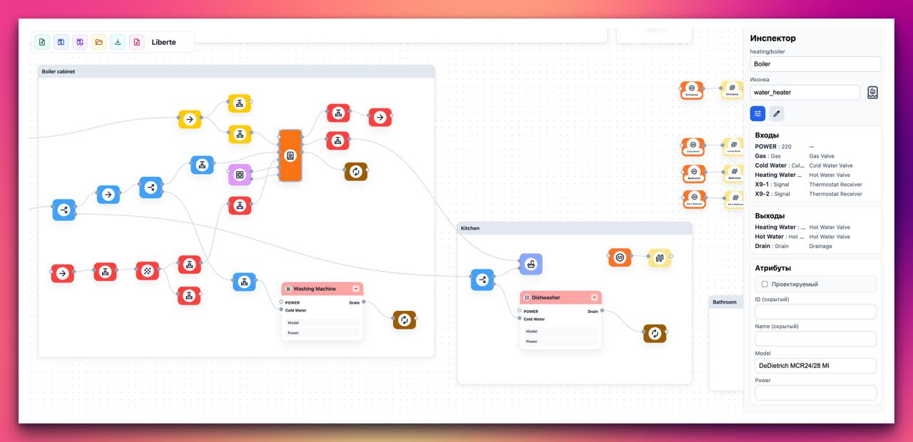

# Liberté Graph v2

Visual home schematic editor (React + React Flow).



## Requirements

- macOS/Linux
- Node.js 20+ and npm

## Installation

### Run locally

#### Dev

```bash
git clone https://github.com/avchaykin/liberte-graph-v2.git
cd liberte-graph-v2
npm install
npm run dev -- --host 0.0.0.0 --port 4180
```

Open: `http://localhost:4180`

#### Production preview

```bash
git clone https://github.com/avchaykin/liberte-graph-v2.git
cd liberte-graph-v2
npm install
npm run build
npm run preview -- --host 0.0.0.0 --port 4180 --strictPort
```

Open: `http://localhost:4180`

### Homebrew

> Формула публикуется через tap `avchaykin/liberte-graph-v2`.

Install (one-liner):

```bash
brew install --HEAD avchaykin/liberte-graph-v2/liberte-graph-v2
brew services start liberte-graph-v2
```

Update to latest HEAD:

```bash
brew update
brew upgrade --fetch-HEAD avchaykin/liberte-graph-v2/liberte-graph-v2 || \
brew reinstall --HEAD avchaykin/liberte-graph-v2/liberte-graph-v2
brew services restart liberte-graph-v2
```

Manage:

```bash
brew services restart liberte-graph-v2
brew services stop liberte-graph-v2
brew services list | grep liberte-graph-v2
```

## Notes

- App data (saved schemas/autosave) is stored in browser `localStorage`.
- Export/Import from UI uses JSON files.
